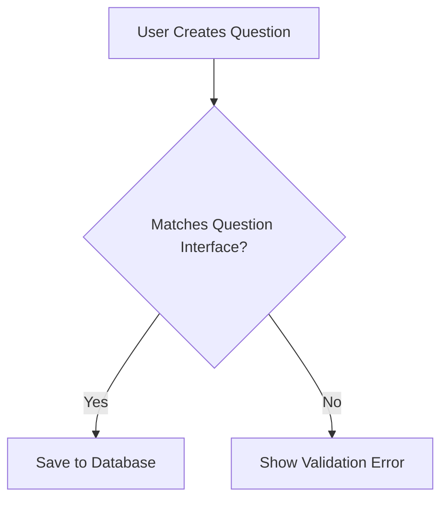

# Chapter 1: TypeScript Interfaces

## Introduction to Interfaces: Defining Data Shapes

Imagine you're building a Q&A platform where questions need to follow a specific structure. Just like a standardized form ensures all information is captured correctly, TypeScript interfaces help us define exactly what data should look like in our application.

### What are Interfaces?

An interface in TypeScript is like a blueprint or a contract that describes the shape of an object. It specifies what properties an object must have and what type those properties should be. Think of it as a detailed checklist that ensures every piece of data in your application meets certain requirements.

### A Real-World Example: Question Interface

Let's look at a concrete example from our Q&A platform. We want to make sure every question has specific information:

```typescript
interface Question {
  title: string;       // A clear, concise title
  text: string;        // Detailed question description
  tags: Tag[];         // Associated tags
  askedBy: string;     // Username of the person asking
  askDateTime: Date;   // When the question was asked
}
```

This interface ensures that:
- Every question MUST have a title (a string)
- Every question MUST have detailed text
- Every question MUST have tags
- Every question MUST specify who asked it
- Every question MUST have a timestamp

### Why Use Interfaces?

1. **Data Consistency**: Prevents accidentally creating incomplete or incorrect objects
2. **Type Safety**: Catches errors before runtime
3. **Code Clarity**: Serves as documentation for how data should be structured

### Creating and Using an Interface

Here's how you might use the Question interface:

```typescript
// Correct: Matches the interface
const validQuestion: Question = {
  title: "How to use TypeScript interfaces?",
  text: "I'm new to TypeScript and need help understanding interfaces.",
  tags: [{ name: "typescript", description: "TypeScript programming" }],
  askedBy: "newDeveloper",
  askDateTime: new Date()
};

// Error: Missing required properties
const invalidQuestion: Question = {
  title: "Incomplete Question"
  // This would cause a TypeScript error!
};
```

### Optional Properties

Sometimes, you might want some properties to be optional:

```typescript
interface Question {
  title: string;
  text: string;
  tags: Tag[];
  askedBy: string;
  askDateTime: Date;
  views?: number;  // Optional property (note the '?')
}
```

The `?` makes the `views` property optional, so it's okay if it's not provided.

### Interfaces in Action: Visual Representation



### Best Practices

1. Use meaningful, descriptive names
2. Keep interfaces focused and simple
3. Use interfaces to define the shape of data early in your design

## Conclusion

TypeScript interfaces are powerful tools for defining data structures, ensuring type safety, and making your code more predictable and self-documenting. They act as guardians, making sure your data follows the rules you've set.

In the [next chapter](02_mongoose_schemas_.md), we'll explore how these interfaces connect with Mongoose Schemas to persist our data in the database.

---

Generated by [AI Codebase Knowledge Builder](https://github.com/The-Pocket/Tutorial-Codebase-Knowledge)