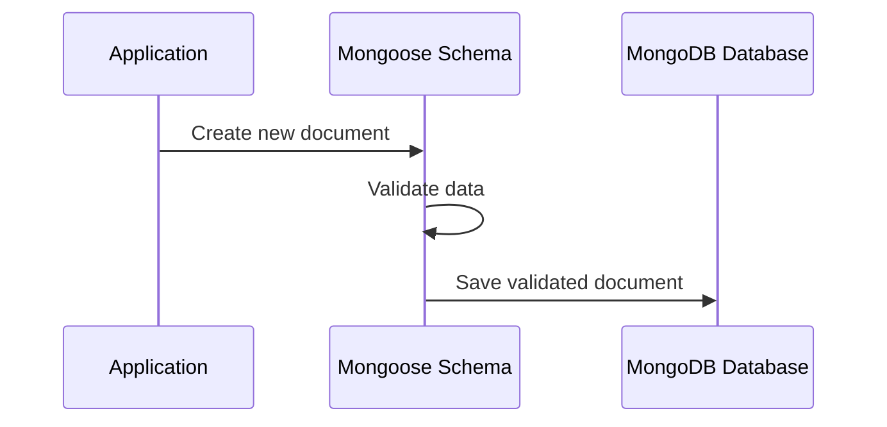

# Chapter 2: Mongoose Schemas

## Bridging the Gap: From TypeScript Interfaces to Database Structures

In the [previous chapter](01_typescript_interfaces_.md), we learned how TypeScript interfaces help us define the shape of our data. Now, let's explore how we turn these interfaces into actual database structures using Mongoose Schemas.

### The Problem: Turning Data Blueprints into Database Reality

Imagine you're building a Q&A platform. You've defined a beautiful TypeScript interface for a question, but how do you actually store this in a database? This is where Mongoose Schemas come to the rescue!

### What are Mongoose Schemas?

Think of a Mongoose Schema like a detailed architectural blueprint for your database documents. Just as an architect creates a precise plan before building a house, a Mongoose Schema defines exactly how your data will be structured in MongoDB.

### A Practical Example: Question Schema

Let's look at a simple Question Schema that matches our previous TypeScript interface:

```typescript
import { Schema } from 'mongoose';

const questionSchema = new Schema({
  title: {
    type: String,
    required: true,     // Title must exist
    trim: true          // Remove extra whitespace
  },
  text: {
    type: String,
    required: true
  },
  tags: [{
    type: Schema.Types.ObjectId, 
    ref: 'Tag'          // Reference to another collection
  }],
  askedBy: String,
  askDateTime: Date
});
```

### Key Features of Mongoose Schemas

1. **Type Validation**: Ensures data matches expected types
2. **Required Fields**: Mandate certain information
3. **Data Transformations**: Like trimming whitespace
4. **Relationships**: Connect different collections

### How Schemas Work: A Visual Journey



### Real-World Validation Example

```typescript
const question = new QuestionModel({
  title: "  How to use Mongoose?  ",  // Note the extra spaces
  text: "I need help understanding Mongoose Schemas",
  askedBy: "newDeveloper"
});

// Automatically trims title
// Saves to database if all required fields are present
question.save();
```

### Advanced Schema Features

1. **Custom Validation**
```typescript
title: {
  type: String,
  validate: {
    validator: function(v) {
      return v.length >= 10;  // Minimum title length
    },
    message: 'Title must be at least 10 characters'
  }
}
```

### Best Practices

1. Keep schemas clean and focused
2. Use validation to maintain data integrity
3. Leverage Mongoose's built-in methods

## Conclusion

Mongoose Schemas transform our TypeScript interfaces into robust, validated database structures. They're the bridge between your application's data model and the actual database storage.

In the [next chapter](03_mongoose_models_.md), we'll explore how to create Models using these Schemas and start interacting with our database.

---

Generated by [AI Codebase Knowledge Builder](https://github.com/The-Pocket/Tutorial-Codebase-Knowledge)