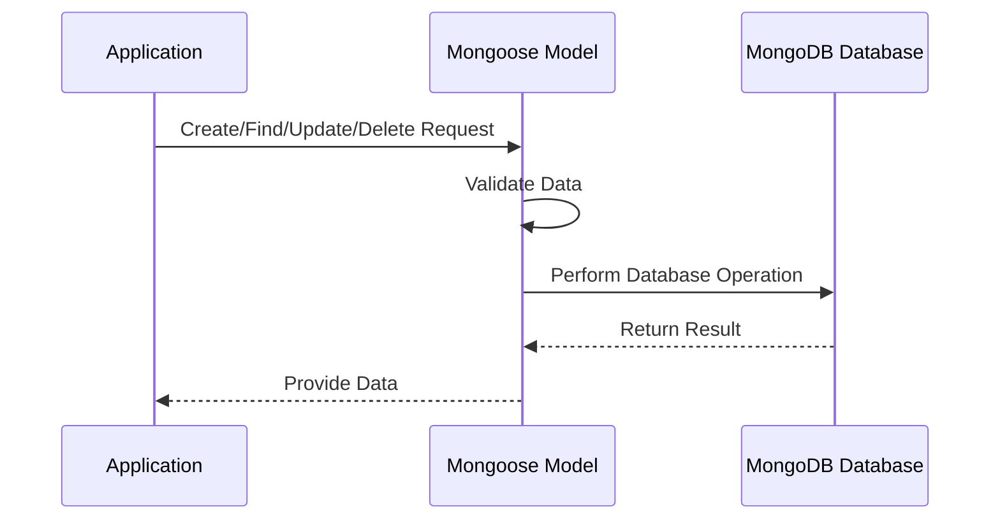

# Chapter 3: Mongoose Models

## From Blueprints to Database Magic: Creating Mongoose Models

In the [previous chapter](02_mongoose_schemas_.md), we learned how to create schemas that define the structure of our data. Now, let's explore Mongoose Models - the magical bridge that transforms our schemas into powerful database interaction tools!

### Imagine Building a Digital Library

Think of Mongoose Models like librarian robots. Just as a librarian knows exactly how to catalog, store, and retrieve books, Mongoose Models know precisely how to handle your data in the database.

### What are Mongoose Models?

A Mongoose Model is a special constructor that creates documents representing data in MongoDB. It's like a smart form that:
- Validates your data
- Creates new database entries
- Finds and updates existing records
- Deletes records when needed

### A Simple Example: Creating a User Model

```typescript
import mongoose from 'mongoose';
import userSchema from './schemas/user';

// Create a User Model
const UserModel = mongoose.model('User', userSchema);
```

This single line of code does something incredible! It creates a powerful interface to interact with your user data.

### How Models Work: Real-World Interactions

Let's see how our UserModel can perform different database operations:

1. **Creating a New User**
```typescript
const newUser = new UserModel({
  username: 'codingNinja',
  email: 'ninja@code.com',
  age: 25
});

// Save the user to the database
await newUser.save();
```

2. **Finding Users**
```typescript
// Find all users
const allUsers = await UserModel.find();

// Find a specific user
const specificUser = await UserModel.findOne({ username: 'codingNinja' });
```

3. **Updating a User**
```typescript
await UserModel.updateOne(
  { username: 'codingNinja' },
  { age: 26 }
);
```

4. **Deleting a User**
```typescript
await UserModel.deleteOne({ username: 'codingNinja' });
```

### Behind the Scenes: Model Magic



### Best Practices

1. Create a model for each major data type
2. Keep models focused on a single responsibility
3. Use models consistently across your application

### Advanced Model Features

Models can also:
- Define custom methods
- Create complex queries
- Manage relationships between data

## Conclusion

Mongoose Models are your database's best friends. They provide a clean, consistent way to interact with your data, handling all the complex database operations behind the scenes.

In the [next chapter](04_application_service_functions_.md), we'll explore how to create service functions that use these models to build the core logic of our application.

---

Generated by [AI Codebase Knowledge Builder](https://github.com/The-Pocket/Tutorial-Codebase-Knowledge)