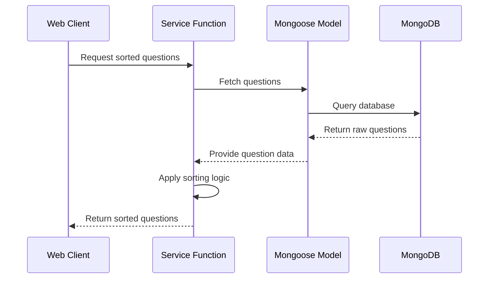

# Chapter 4: Application Service Functions

## Bridging the Gap: From Models to Smart Business Logic

In the [previous chapter](03_mongoose_models_.md), we learned how Mongoose Models help us interact with our database. Now, let's explore Application Service Functions - the skilled data managers that transform raw database operations into meaningful business logic!

### Imagine Running a Q&A Platform Kitchen 🍳

Think of Application Service Functions like expert chefs in a restaurant kitchen. Just as a chef knows exactly how to combine ingredients, prepare dishes, and handle complex cooking processes, these service functions know precisely how to:
- Retrieve data
- Process information
- Apply business rules
- Handle complex database interactions

### The Problem: Raw Data Isn't Enough

When you're building a Q&A platform, simply fetching questions from the database isn't enough. You need to:
- Sort questions by different criteria (newest, most active, unanswered)
- Filter questions by tags or keywords
- Add complex business logic like view counting

### Meet the Service Functions Toolkit

```typescript
// In application.ts
export const getQuestionsByOrder = async (order: OrderType): Promise<Question[]> => {
  try {
    // Fetch questions based on order type
    let questions = await QuestionModel.find().populate('tags');

    if (order === 'newest') {
      return sortByNewestQuestions(questions);
    }
    if (order === 'active') {
      return sortByMostActiveQuestions(questions);
    }
    // More sorting logic...
  } catch (error) {
    return []; // Handle errors gracefully
  }
};
```

This function is like a smart question sorter. Depending on the order type, it can:
- Sort questions by newest
- Sort questions by most active
- Handle different sorting scenarios

### How Service Functions Work: Behind the Scenes



### Key Characteristics of Service Functions

1. **Data Transformation**: Convert raw database data into meaningful results
2. **Error Handling**: Gracefully manage potential database or processing errors
3. **Business Logic Implementation**: Apply complex rules to data

### Real-World Examples

Let's look at some practical service functions:

```typescript
// Filter questions by search term
export const filterQuestionsBySearch = (questions: Question[], search: string) => {
  const tags = extractTags(search);
  const keywords = extractKeywords(search);

  return questions.filter(question => 
    matchesTags(question, tags) || 
    matchesKeywords(question, keywords)
  );
};

// Increment question view count
export const incrementQuestionViews = async (questionId: string, username: string) => {
  await QuestionModel.findByIdAndUpdate(
    questionId, 
    { $addToSet: { views: username } }
  );
};
```

### Best Practices

1. Keep functions focused on a single responsibility
2. Handle potential errors
3. Return meaningful, transformed data
4. Use TypeScript for type safety

## Conclusion

Application Service Functions are the intelligent middleware between your database models and the rest of your application. They transform raw data into meaningful, processed information, applying business logic and ensuring data integrity.

In the [next chapter](05_express_router_controllers_.md), we'll explore how these service functions integrate with Express Router Controllers to handle web requests.

---

Generated by [AI Codebase Knowledge Builder](https://github.com/The-Pocket/Tutorial-Codebase-Knowledge)