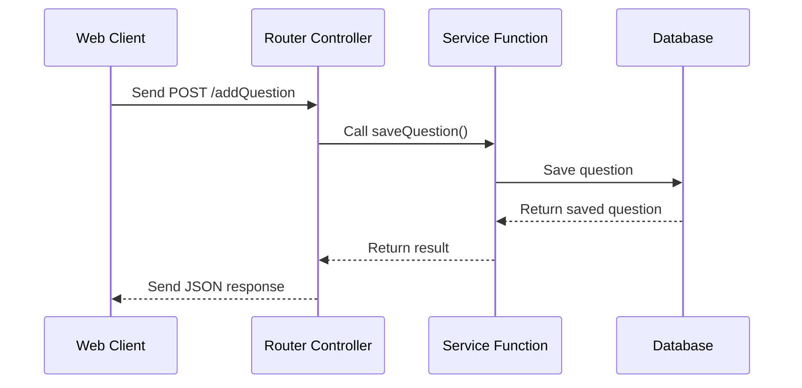

# Chapter 5: Express Router Controllers

In the [previous chapter](04_application_service_functions_.md), we learned how to create service functions that handle our application's core logic. Now, let's explore Express Router Controllers - the traffic directors of our web application!

## Imagine Running a Digital Information Desk 🏢

Think of Express Router Controllers like helpful receptionists in a large office building. Just as a receptionist:
- Receives visitors
- Directs them to the right department
- Handles specific types of requests

Router Controllers do the same for web requests in our application.

## The Problem: Organizing Web Request Handling

In a Q&A platform, we need to handle different types of requests:
- Adding a new question
- Fetching questions
- Voting on questions

How do we organize these different actions efficiently?

## Enter: Express Router Controllers

A Router Controller is a specialized Express router that:
- Groups related routes together
- Handles specific domain logic (questions, answers, profiles)
- Connects web requests to our service functions

### A Simple Example: Question Controller

```typescript
const questionController = (socket: FakeSOSocket) => {
  const router = express.Router();

  // Route for adding a new question
  const addQuestion = async (req, res) => {
    const question = req.body;
    const savedQuestion = await saveQuestion(question);
    res.json(savedQuestion);
  };

  // Route for fetching questions
  const getQuestions = async (req, res) => {
    const questions = await getQuestionsByOrder(req.query.order);
    res.json(questions);
  };

  // Define routes
  router.post('/addQuestion', addQuestion);
  router.get('/getQuestions', getQuestions);

  return router;
};
```

This controller does three key things:
1. Creates route handlers for questions
2. Connects these handlers to service functions
3. Returns a configurable router

### Behind the Scenes: Request Processing



## Integrating Controllers in Your Server

```typescript
// In app.ts
app.use('/question', questionController(socket));
app.use('/answer', answerController(socket));
app.use('/profile', profileController(socket));
```

This setup allows different controllers to handle their specific domains while keeping the main server file clean and organized.

## Best Practices

1. Keep controllers focused on a single domain
2. Use service functions for complex logic
3. Validate incoming requests
4. Handle errors gracefully

## Conclusion

Express Router Controllers help us organize web request handling by:
- Grouping related routes
- Connecting requests to service functions
- Providing a clean, modular structure

In the [next chapter](06_express_middleware_and_routes_.md), we'll explore middleware and how it can enhance our request processing.

---

Generated by [AI Codebase Knowledge Builder](https://github.com/The-Pocket/Tutorial-Codebase-Knowledge)