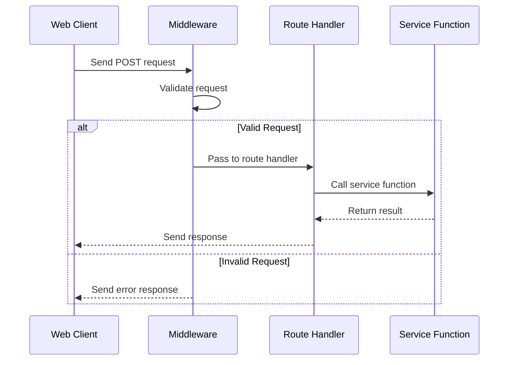

# Chapter 6: Express Middleware and Routes

In the [previous chapter](05_express_router_controllers_.md), we explored how Express Router Controllers help us organize web request handling. Now, let's dive into the world of Express Middleware and Routes - the guardians and mappers of our web application's request journey! 🛡️🗺️

## Imagine a Security Checkpoint at an Airport 🛂

Think of Express Middleware and Routes like the security and information systems at an airport:
- Middleware = Security Checkpoints
  - Inspect every passenger (request)
  - Check documents (validate data)
  - Ensure safety before entry
- Routes = Airport Directories
  - Direct passengers to correct gates
  - Map specific requests to specific handlers

## What are Middleware and Routes?

### Middleware: The Request Inspectors

Middleware functions are like security guards that process requests before they reach their final destination. They can:
- Validate incoming data
- Check user authentication
- Log request information
- Modify request or response objects

### A Simple Middleware Example

```typescript
const validateQuestionMiddleware = (req, res, next) => {
  const { title, text } = req.body;

  // Check if question has required fields
  if (!title || !text) {
    return res.status(400).json({ error: 'Missing question details' });
  }

  // If validation passes, continue to next handler
  next();
};
```

This middleware ensures that every question submission has a title and text. If not, it stops the request and sends an error.

### Routes: The Request Mappers

Routes define how different types of requests are handled. They connect URLs to specific controller functions.

```typescript
router.post('/add', validateQuestionMiddleware, addQuestionController);
```

This route says:
- When a POST request arrives at '/add'
- First run `validateQuestionMiddleware`
- If validation passes, run `addQuestionController`

### Middleware Flow: Behind the Scenes



## Putting It All Together

```typescript
// In questionController.ts
const questionController = () => {
  const router = express.Router();

  // Middleware for logging
  const requestLogger = (req, res, next) => {
    console.log(`Request to ${req.path} at ${new Date()}`);
    next();
  };

  // Authentication middleware
  const requireAuth = (req, res, next) => {
    if (!req.user) {
      return res.status(401).json({ error: 'Login required' });
    }
    next();
  };

  // Routes with middleware
  router.use(requestLogger);  // Log all requests
  router.post('/add', requireAuth, validateQuestionMiddleware, addQuestion);
  router.get('/list', requireAuth, listQuestions);

  return router;
};
```

## Best Practices

1. Keep middleware functions focused
2. Use middleware for cross-cutting concerns
3. Chain multiple middleware if needed
4. Always call `next()` to continue request processing

## Conclusion

Express Middleware and Routes provide a powerful way to:
- Inspect and validate requests
- Add authentication and logging
- Organize request handling

In the [next chapter](07_socket_io_real_time_communication_.md), we'll explore how to add real-time communication to our application using Socket.IO.

---

Generated by [AI Codebase Knowledge Builder](https://github.com/The-Pocket/Tutorial-Codebase-Knowledge)