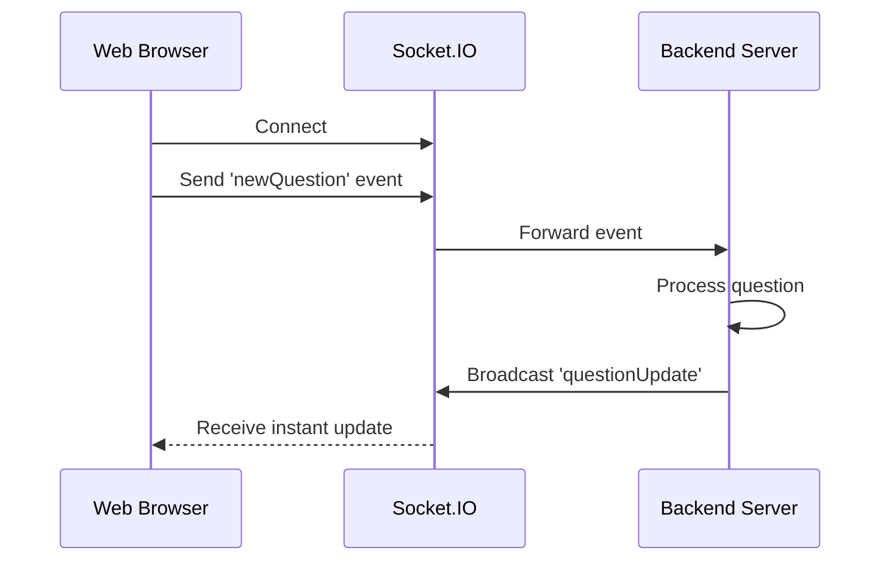

# Chapter 7: Socket.IO Real-time Communication

In the [previous chapter](06_express_middleware_and_routes_.md), we explored how Express Middleware helps us process and validate web requests. Now, let's dive into the exciting world of Socket.IO - the magic that brings real-time updates to our Q&A platform! 🚀

## Imagine a Live Classroom 🏫

Think of Socket.IO like a smart classroom where:
- When one student asks a question, everyone instantly sees it
- When another student answers, the entire class knows immediately
- Updates happen in real-time without refreshing the page

### The Problem: Instant Updates Matter

In our Q&A platform, we want users to:
- See new questions instantly
- Get notifications when someone answers
- Experience a dynamic, interactive environment

### Enter: Socket.IO

Socket.IO is like a digital announcement system that:
- Connects server and clients instantly
- Sends updates in real-time
- Works across different browsers and devices

### How Socket.IO Works: A Simple Example

```typescript
// In server setup (app.ts)
const socket = new Server(server, {
  cors: { origin: '*' }
});

socket.on('connection', (clientSocket) => {
  console.log('New user connected');

  // Listen for specific events
  clientSocket.on('newQuestion', (questionData) => {
    // Broadcast the new question to all connected clients
    socket.emit('questionUpdate', questionData);
  });
});
```

This code does something magical:
- When a user creates a question
- The server receives the event
- It immediately broadcasts the update to all connected clients

### Real-World Scenario: Question Notification

```typescript
// In question controller
const addQuestion = async (req, res) => {
  const savedQuestion = await saveQuestion(req.body);
  
  // Notify all users about the new question
  socket.emit('questionUpdate', savedQuestion);
  
  res.json(savedQuestion);
};
```

### Behind the Scenes: Socket Event Flow



### Key Socket.IO Concepts

1. **Events**: Named messages sent between server and client
2. **Broadcast**: Sending updates to multiple clients
3. **Real-time Communication**: Instant data transfer

### Best Practices

1. Use socket events for dynamic updates
2. Keep event payloads small
3. Handle connection/disconnection events
4. Secure your socket connections

## Conclusion

Socket.IO transforms our application from a static webpage to a live, interactive platform. It enables instant communication, making our Q&A platform feel alive and responsive.

In the [next chapter](08_database_population_scripts_.md), we'll explore how to populate our database with initial data.

---

Generated by [AI Codebase Knowledge Builder](https://github.com/The-Pocket/Tutorial-Codebase-Knowledge)