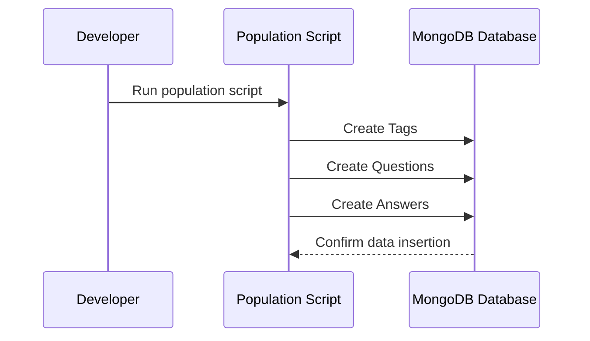

# Chapter 8: Database Population Scripts

In the [previous chapter](07_socket_io_real_time_communication_.md), we explored how Socket.IO enables real-time communication in our application. Now, let's dive into a crucial aspect of development: Database Population Scripts - the magical helpers that prepare our database with initial data! 🌱

## Imagine Setting Up a Brand New Bookstore 📚

Think of Database Population Scripts like a bookstore manager preparing shelves before opening day:
- They create sample books
- Arrange them neatly on shelves
- Ensure the store looks inviting and functional

In our Q&A platform, these scripts will:
- Create sample questions
- Add initial tags
- Populate the database with realistic data for testing

## Why Do We Need Population Scripts?

When you're building an application, you don't want to start with an empty database. These scripts help by:
- Providing realistic test data
- Making development and testing easier
- Ensuring your application works with sample content

### The Magic of Population Scripts

```typescript
const populateDatabase = async () => {
  // Create initial tags
  const webTag = await TagModel.create({ 
    name: 'web-development', 
    description: 'Questions about web technologies' 
  });

  // Create sample questions
  await QuestionModel.create({
    title: 'How to learn React?',
    text: 'I\'m a beginner and want to start with React...',
    tags: [webTag],
    askedBy: 'newDeveloper'
  });
};
```

This simple script does three important things:
1. Creates a tag for web development
2. Creates a sample question
3. Links the tag to the question

## Behind the Scenes: Database Population Process



## Key Components of Population Scripts

1. **Tag Creation**
```typescript
async function createTags() {
  return [
    await TagModel.create({ 
      name: 'javascript', 
      description: 'Programming language for web' 
    }),
    await TagModel.create({ 
      name: 'react', 
      description: 'JavaScript library for UI' 
    })
  ];
}
```

2. **Question Creation**
```typescript
async function createQuestions(tags) {
  await QuestionModel.create({
    title: 'Understanding React Hooks',
    text: 'How do React hooks work?',
    tags: tags,
    askedBy: 'learner2023'
  });
}
```

## Best Practices

1. Keep scripts modular
2. Use meaningful, realistic data
3. Make scripts repeatable
4. Handle potential errors

## Example: Complete Population Script

```typescript
const populateDatabase = async () => {
  try {
    const tags = await createTags();
    await createQuestions(tags);
    console.log('Database populated successfully!');
  } catch (error) {
    console.error('Population failed:', error);
  }
};
```

## Conclusion

Database Population Scripts are like helpful assistants that prepare your application's environment. They ensure you have meaningful data to work with from the moment you start developing.

In the [next chapter](09_testing_framework_.md), we'll explore how to create a robust testing framework for our application.

---

Generated by [AI Codebase Knowledge Builder](https://github.com/The-Pocket/Tutorial-Codebase-Knowledge)