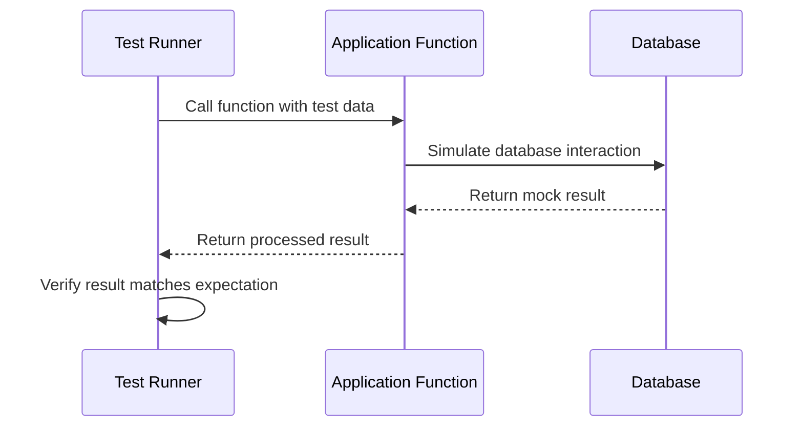

# Chapter 9: Testing Framework

In the [previous chapter](08_database_population_scripts_.md), we explored how to populate our database with initial data. Now, let's dive into the crucial world of Testing Framework - the quality control system for our application! 🕵️‍♀️🔍

## Imagine Building a Reliable Machine 🏭

Think of a Testing Framework like a quality control process in a factory. Just as a car manufacturer thoroughly checks each component before shipping a vehicle, our testing framework ensures every part of our application works perfectly before reaching users.

### The Problem: Ensuring Application Reliability

In our Q&A platform, we need to make sure:
- Questions are saved correctly
- Users can add comments
- API endpoints return the right data
- Error scenarios are handled gracefully

### Enter: Jest Testing Framework

Jest is like a detailed inspector who:
- Checks each function works as expected
- Simulates different scenarios
- Reports any issues before they reach users

### Setting Up Our Testing Environment

First, let's set up Jest in our project:

```typescript
// jest.config.ts
module.exports = {
  preset: 'ts-jest',
  testEnvironment: 'node'
};
```

This configuration tells Jest how to process TypeScript files and where to run tests.

### Writing Our First Test: A Simple Example

Let's test a comment addition function:

```typescript
// tests/comment.spec.ts
describe('Adding Comments', () => {
  it('should add a comment to a question', async () => {
    const mockComment = {
      text: 'Great question!',
      commentBy: 'user123',
      commentDateTime: new Date()
    };

    const result = await addComment('questionId', 'question', mockComment);

    expect(result.comments.length).toBe(1);
    expect(result.comments[0].text).toBe('Great question!');
  });
});
```

This test checks that:
- A comment can be added to a question
- The comment is saved correctly
- The function returns the updated question

### Behind the Scenes: How Testing Works



### Types of Tests We'll Write

1. **Unit Tests**: Check individual functions
2. **Integration Tests**: Verify components work together
3. **API Tests**: Simulate HTTP requests

### Running Our Tests

Add a script to `package.json`:

```json
{
  "scripts": {
    "test": "jest",
    "test:watch": "jest --watch"
  }
}
```

Now you can run tests with:
- `npm test` (run all tests once)
- `npm run test:watch` (continuously run tests during development)

### Best Practices

1. Write tests before or alongside code
2. Cover different scenarios (success, failure)
3. Keep tests small and focused
4. Mock external dependencies

## Conclusion

The Testing Framework acts as our application's quality guardian. By writing comprehensive tests, we ensure our Q&A platform works flawlessly, catching potential issues before they reach users.

In the next chapter, we'll explore [Deployment Strategies](10_deployment_strategies_.md) to bring our thoroughly tested application to life!

---

Generated by [AI Codebase Knowledge Builder](https://github.com/The-Pocket/Tutorial-Codebase-Knowledge)