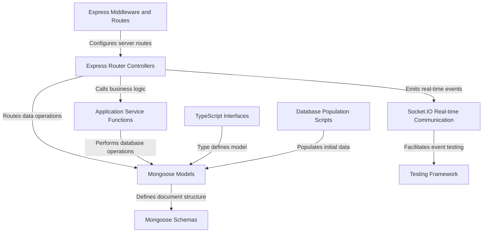

# Tutorial: server

**Fake Stack Overflow** is a web application that enables users to interact in a community-driven Q&A platform similar to Stack Overflow. **Users can ask questions, provide answers, add comments, vote on content, and join different communities**. The platform uses *real-time communication* and supports features like user profiles, messaging, and community interactions.

**Source Repository:** [None](None)

## Chapters

1. [TypeScript Interfaces
](01_typescript_interfaces_.md)
2. [Mongoose Schemas
](02_mongoose_schemas_.md)
3. [Mongoose Models
](03_mongoose_models_.md)
4. [Application Service Functions
](04_application_service_functions_.md)
5. [Express Router Controllers
](05_express_router_controllers_.md)
6. [Express Middleware and Routes
](06_express_middleware_and_routes_.md)
7. [Socket.IO Real-time Communication
](07_socket_io_real_time_communication_.md)
8. [Database Population Scripts
](08_database_population_scripts_.md)
9. [Testing Framework
](09_testing_framework_.md)

---

Generated by [AI Codebase Knowledge Builder](https://github.com/The-Pocket/Tutorial-Codebase-Knowledge)
